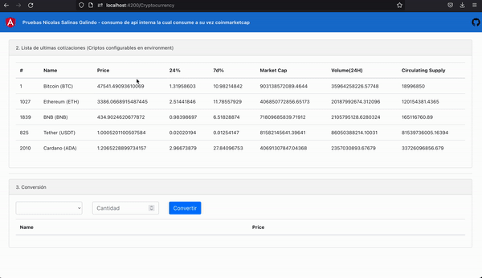
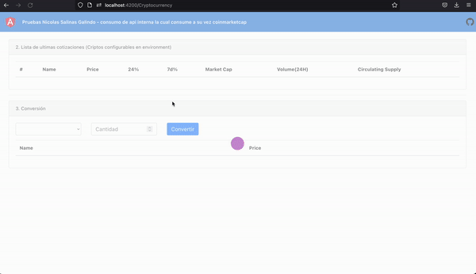
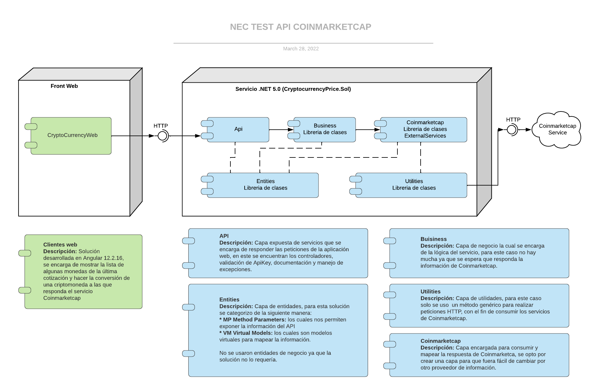
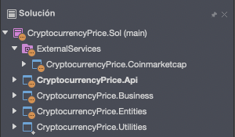
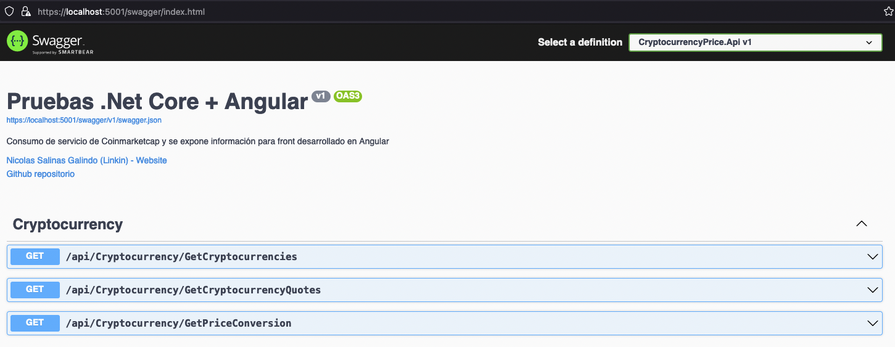
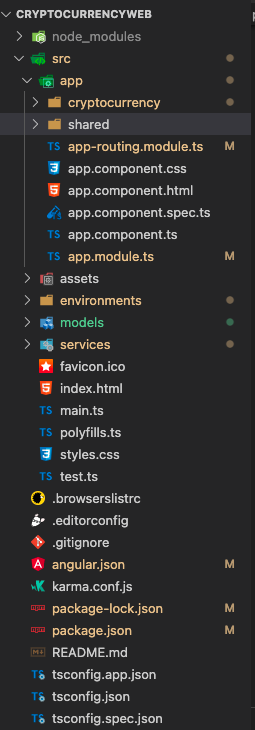

# Pruebas Nicolas Salinas Galindo

A continuación se datalla la solución de las pruebas en estas encontraran los siguientes temas: 

* __Evidencias__ de la solución para el punto 2 y punto 3 del ejercicio práctico.
* __Arquitectura__ de las soluciones con su especificación de cada capa.
* __Especificación de solución de API__ desarrollada en .__NET 5.0.__
  * Estructura
  * Configuración
* __Especificación de la solución web__ desarrollada en __Angular 12.2.16.__
  * Estructura
  * Configuración

## EVIDENCIAS

Se adiciona evidencias de funcionamiento de la aplicación web, apuntando a API local el cual consume API de Coinmarketcap:

* Listado de últimas cotizaciones de monedas específicas, se apunta a producción de Coinmarketcap sin errores, estas se configuran por enviroments.DefaultCryptocurrenciesList en el proyecto de Angular.



* Conversión de criptomoneda, se realizan pruebas en API de test de Coinmarketcap sin errores, se cambia a servidor de producción y contiene errores, por este motivo se envía evidencia con información que devuelve Coinmarketcap en el API de test.



## ARQUITECTURA

Se desarrolla una arquitectura cliente servidor, donde el proyecto web es independiente al proyecto API, a continuación se muestra un diagrama por componentes, posteriormente se explican estructuras de los proyectos de forma independiente.



## NET CORE 5.0 API (CryptocurrencyPrice)

La solución se estructuró por capas para que sea altamente mantenible y desacoplada, se crearon las siguientes capas:

### __Estructura de proyecto API__



* __Api__\
Es la capa que se expone al cliente la cual contiene los controladores a exponer, para esta solución se implementaron validación de excepciones y ApiKey de manera genérica con el fin de poder ser reutilizado en toda la solución, también se adiciono documentación por medio de SWAGGER. A continuación se muestra la documentación:



* __Business__\
Es la capa encargada de la lógica de negocio, para este proyecto lo único que hace es conectarse a la capa de Coinmarketcap  para consultar los datos ya que no hay validaciones o lógica adicional para los métodos.

* __Entities__\
Es la capa que contiene las entidades necesarias para mapear la información y retornar los datos, para esta solución no hay entidades de negocio, por lo que se optó por categorizar las clases de la siguiente manera:
  * MP (Method Parameters): Son los parámetros de entrada y salida de los métodos del API.
  * VM: (Virtual Model): Son las modelos virtuales para mapear información interna que se quiere devolver en el servicio.

* __Utilities__\
Es la capa de utilidades, esta se usa para generar funciones genéricas que se necesiten a lo largo de la solución, para este caso únicamente se tiene una función de consumo generico de servicios por metodo de GET.}

* ExternalServices\
Se crea esta carpeta para adicionar los proyectos que consuman servicios externos, para este proyecto solo consumimos Coinmarketcap.
  * __Coinmarketcap__\
   Es la capa con la lógica de negocio para consumir y mapear a nuestra solución la información retornada por el [API de Coinmarketcap](https://coinmarketcap.com/api/documentation/v1/).\
   *Tuve problemas con el consumo a Coinmarketcap ya que la estructura que devuelve en algunos objetos es dinámica, se realizó proceso para poder mapear la información en entidades internas.*

### __CONFIGURACIÓN__

Se adiciona configuración en el archivo Appsettings.json en el proyecto CryptocurrencyPrice.Api para setear los datos de Coinmarketcap y el ApiKey.

* Coinmarketcap:
  * ApiURL: Indica la dirección del servicio de Coinmarketcap, para esta configuración se encuentra apuntando a test.
  * ApiKey: Llave de Coinmarketcap
  * HeaderApiKeyName: Nombre del header que recibe Coinmarketcap para el ApiKey
* ApiKey: Api Key interna para validación de header de los clientes que consumen el servicio.

```json
{
 "Coinmarketcap": {
   "ApiURL": "https://sandbox-api.coinmarketcap.com/v1/",
   "ApiKey": "b54bcf4d-1bca-4e8e-9a24-22ff2c3d462c",
   "HeaderApiKeyName": "X-CMC_PRO_API_KEY"
 },
 "ApiKey": "6f28ca3a-3007-482b-90d1-a03f8ad887aa"
}
```

## ANGULAR 12.2.16 (CryptoCurrencyWeb)

### __Estructura de proyecto Web__



Se creo el modulo "cryptocurrency" para adicionar los componentes que tengan que ver con la información de las criptomonedas, y el módulo "share" con el fin de poner los componentes genéricos de la aplicación.

### __CONFIGURACIÓN__

En adiciona configuración en los archivos de environments para setear la información según necesidad.

* ApiUrl: Api del servicio desarrollado en .NET CORE 5.0 (CryptocurrencyPrice).
* ApiKey: Key del servicio, este debe coincidir con el dato de Appsetting.json del servicio.
* DefaultCryptocurrenciesList: Lista separada por "," con los símbolos de las criptomonedas para consultar las últimas cotizaciones.

```typescript
export const environment = {
 ApiUrl: "https://localhost:5001/api/",
 ApiKey: "6f28ca3a-3007-482b-90d1-a03f8ad887aa",
 DefaultCryptocurrenciesList: "BTC,ETH,BNB,USDT,ADA"
};
```
